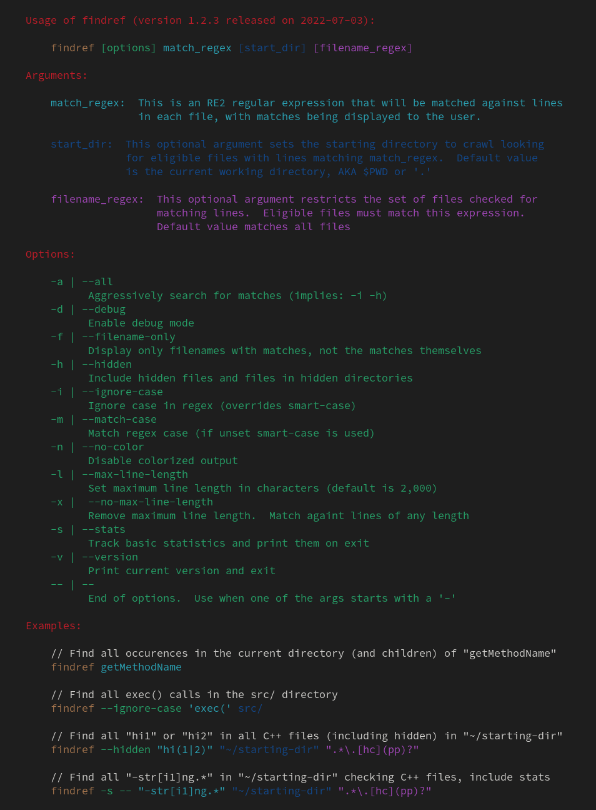
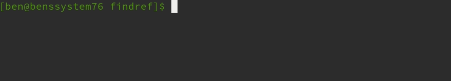

# fr / findref


`findref` (commonly aliased to `fr`) helps you find strings, or match regular expressions, in a directory of files.  It is inspired by `git grep` which is a good tool, but has limitations that made writing a replacement a worthy endeavor.

`findref` regular expressions are golang regexes.  Golang regexes have "the [same general
syntax](https://github.com/google/re2/wiki/Syntax) used by Perl, Python, and other languages.
More precisely, it is [the syntax accepted by RE2](https://github.com/google/re2/wiki/Syntax)."
A large benefit of this, is that "the regexp implementation ... [is guaranteed to run in
time linear in the size of the input](https://swtch.com/~rsc/regexp/regexp1.html).
(This is a property not guaranteed by most open source implementations of regular expressions.)" (see: https://golang.org/pkg/regexp/).  This regex run-time is one of the things that makes
`findref` faster than many other tools.


## How it compares to other tools (or why it is better in my opinion):

**grep**:  `findref` adds much simpler recursive search that doesn't require a bunch of
tedious flags to get pleasant output.  It also ignores hidden files by default,
which helps you avoid a lot of junk matches.  findref has a lot of handy command line
switches that make it easier to find the needle in the haystack.  For example, the ability
to restrict search to files whose name matches a specified regex.  The output of `findref` is
identical to grep's line numbers and colors (but are on by default).  Speed-wise, grep
is faster.  It's hard to beat this venerable tool in performance.

**git grep**:  `findref` output looks very similar, but adds colorization, which makes
reading it *much* easier.  `findref` also works on non-git repos, unlike git grep.  findref
also supports a variety of switches that make narrowing results easier.

**Ag (or the silver searcher)**:  `findref` is slower (ag is amazingly fast), but has
much better formatting and coloring.  `findref` does not currently have a vim
plugin tho, so for searching within vim, [ag](https://github.com/vim-scripts/ag.vim)
is the way to go.  Ag is also useful for very large codebases.


## Usage

<p align="center">
  
</p>

### Examples:

Let's say we are looking for the string "getMethodName":

Simple usage that starts looking recursively in the current directory, and checks all files (excluding binary files) for the string (which could also be a regular expression)

    findref getMethodName

<p align="center">
  
</p>

To go case insensitive, simply add -i or --ignore-case as the first arg:

    findref --ignore-case getMethodName

By default `findref` uses "smart-case" for matches.  This means if the whole regex is lower
case, the match will be case-insensitve.  If there is an upper case letter, the match will be
case-sensiitive.  You can force case-sensitivity with the -m or --match-case flag:

    findref --match-case getmethodname  # matches getmethodname but not getMethodName

You don't have to search only for strings.  You can pass any valid golang regex:

    findref "str[i1]ng.*"
    findref "st.*ng"

<p align="center">
  
</p>

You can add a starting directory (if none is specified, the default is the current working directory):

    findref "str[i1]ng.*" /home/ben/my-starting-directory

<p align="center">
  
</p>

If you want to restrict which files are searched, you can also do this by passing a file
matching regex.  For example, to only search cpp files:

    findref "str[i1]ng.*" "~/my-starting-directory" ".*.cpp"

Or to restrict the search to C++ code files (.h and .cpp):

    findref "str[i1]ng.*" "~/my-starting-directory" ".*\.[hc](pp)?"

<p align="center">
  
</p>

## Installation

### Use the install script

If you are on an intel-based linux or mac, there is an install script located at
`install.sh`.  If on ARM, Windows, or {Free,Open}BSD, you should download the
appropriate [pre-built binary](#pre-built-binaries) below.

To let the script do the work, run this command.  Make sure to add `sudo` if
installing to a location that isn't writeable by your normal user:

#### In your home directory (Make sure this destination is in your [PATH](http://www.linfo.org/path_env_var.html) variable)

```bash
curl -s https://raw.githubusercontent.com/FreedomBen/findref/master/install.sh | bash -s $HOME/bin
```

#### System-wide for all users (requires root access)
```bash
curl -s https://raw.githubusercontent.com/FreedomBen/findref/master/install.sh | sudo bash -s /usr/local/bin
```

### Pre-built binaries

If you wish, you can download pre-built binaries for your system.  After downloading,
put it somewhere in your [PATH](http://www.linfo.org/path_env_var.html).

I recommend putting it in `~/bin` if you are the only user (`sudo` isn't required
to install in that location), or `/usr/local/bin` if there are multiple users on the system:

#### Current Release Version: 1.3.0

These links will always point to the latest released version, so they are includable in
scripts to get the latest version without having to adjust the version number for new
releases.  Of course if you want to point to a specific release, find the permanent link
on the [ARCHIVES.md](ARCHIVES.md) page.

| Version | Linux | macOS | Windows | FreeBSD | OpenBSD |
|:-------:|:-----:|:-----:|:-------:|:-------:|:--------|
| latest | [386](https://raw.githubusercontent.com/FreedomBen/findref-bin/master/latest/linux/386/findref.zip) - [amd64](https://raw.githubusercontent.com/FreedomBen/findref-bin/master/latest/linux/amd64/findref.zip) - [arm](https://raw.githubusercontent.com/FreedomBen/findref-bin/master/latest/linux/arm/findref.zip) - [arm64](https://raw.githubusercontent.com/FreedomBen/findref-bin/master/latest/linux/arm64/findref.zip) | [386](https://raw.githubusercontent.com/FreedomBen/findref-bin/master/latest/darwin/386/findref.zip) - [amd64](https://raw.githubusercontent.com/FreedomBen/findref-bin/master/latest/darwin/amd64/findref.zip) - [arm64](https://raw.githubusercontent.com/FreedomBen/findref-bin/master/latest/darwin/arm64/findref.zip) | [386](https://raw.githubusercontent.com/FreedomBen/findref-bin/master/latest/windows/386/findref.zip) - [amd64](https://raw.githubusercontent.com/FreedomBen/findref-bin/master/latest/windows/amd64/findref.zip) | [amd64](https://raw.githubusercontent.com/FreedomBen/findref-bin/master/latest/freebsd/amd64/findref.zip) - [arm64](https://raw.githubusercontent.com/FreedomBen/findref-bin/master/latest/freebsd/arm64/findref.zip) | [amd64](https://raw.githubusercontent.com/FreedomBen/findref-bin/master/latest/openbsd/amd64/findref.zip) - [arm64](https://raw.githubusercontent.com/FreedomBen/findref-bin/master/latest/openbsd/arm64/findref.zip) |

These links are perma-links to the binaries for version 1.3.0, meaning even after
a new version is released, these will still get you version 1.3.0.

| Version | Linux | macOS | Windows | FreeBSD | OpenBSD |
|:-------:|:-----:|:-----:|:-------:|:-------:|:--------|
| 1.3.0 | [386](https://raw.githubusercontent.com/FreedomBen/findref-bin/master/1.3.0/linux/386/findref.zip) - [amd64](https://raw.githubusercontent.com/FreedomBen/findref-bin/master/1.3.0/linux/amd64/findref.zip) - [arm](https://raw.githubusercontent.com/FreedomBen/findref-bin/master/1.3.0/linux/arm/findref.zip) - [arm64](https://raw.githubusercontent.com/FreedomBen/findref-bin/master/1.3.0/linux/arm64/findref.zip) | [amd64](https://raw.githubusercontent.com/FreedomBen/findref-bin/master/1.3.0/darwin/amd64/findref.zip) - [arm64](https://raw.githubusercontent.com/FreedomBen/findref-bin/master/1.3.0/darwin/arm64/findref.zip) | [386](https://raw.githubusercontent.com/FreedomBen/findref-bin/master/1.3.0/windows/386/findref.zip) - [amd64](https://raw.githubusercontent.com/FreedomBen/findref-bin/master/1.3.0/windows/amd64/findref.zip) | [amd64](https://raw.githubusercontent.com/FreedomBen/findref-bin/master/1.3.0/freebsd/amd64/findref.zip) - [arm64](https://raw.githubusercontent.com/FreedomBen/findref-bin/master/1.3.0/freebsd/arm64/findref.zip) | [amd64](https://raw.githubusercontent.com/FreedomBen/findref-bin/master/1.3.0/openbsd/amd64/findref.zip) - [arm64](https://raw.githubusercontent.com/FreedomBen/findref-bin/master/1.3.0/openbsd/arm64/findref.zip) |

### Older releases

The full catalog of releases is available to download.  See [ARCHIVES.md](ARCHIVES.md)

### Building from source

To build from source you can either use the docker build wrapper, or build it directly on your system.

If you have your [Go environment](https://golang.org/doc/install) set up
already, you can build it directly from source:

```bash
go get github.com/FreedomBen/findref
go install findref
```

To use the docker build, the easiest way is to clone this repo and use the rake task:

```bash
git clone https://github.com/FreedomBen/findref.git \
 && cd findref \
 && rake
```

Pretty easy, the only downside being that it will build findref for every supported
platform rather than just the one you care about.  You can find the binary you
care about by looking in the `findref-bin` subdirectory and following the directory
structure until you find the correct binary for your system.

You can also build for just
your platform.  Specify your OS for the `GOOS` value, and your arch for `GOARCH`.
See [here for a list of valid targets](https://stackoverflow.com/a/30068222/2062384).

Clone the repo if you haven't already:

```bash
git clone https://github.com/FreedomBen/findref.git && cd findref
```

Then run the build:

Example for Linux x64 (amd64):

```bash
docker run \
  --rm \
  --volume "$(pwd):/usr/src/findref" \
  --workdir "/usr/src/findref" \
  --env GOOS=linux \
  --env GOARCH=amd64 \
  golang:#{GO_VERSION} go build
```

Example for Linux x32 (386):

```bash
docker run \
  --rm \
  --volume "$(pwd):/usr/src/findref" \
  --workdir "/usr/src/findref" \
  --env GOOS=linux \
  --env GOARCH=386 \
  golang:#{GO_VERSION} go build
```

Example for macOS x64 (amd64)

```bash
docker run \
  --rm \
  --volume "$(pwd):/usr/src/findref" \
  --workdir "/usr/src/findref" \
  --env GOOS=darwin \
  --env GOARCH=amd64 \
  golang:#{GO_VERSION} go build
```

After the build your binary should be sitting in the root directory of the repo!
